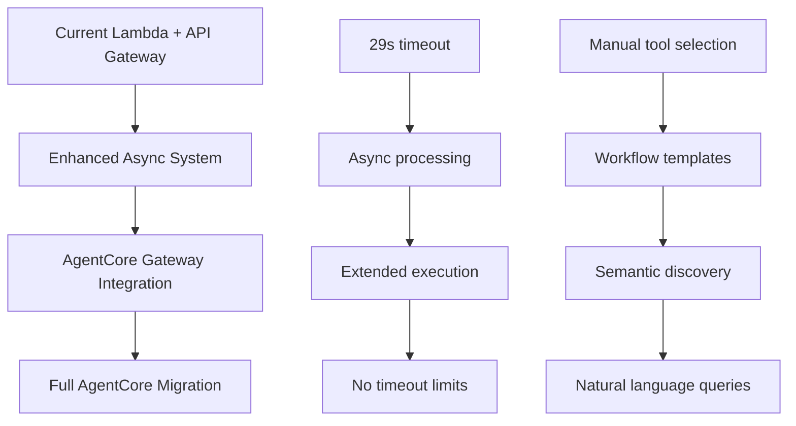
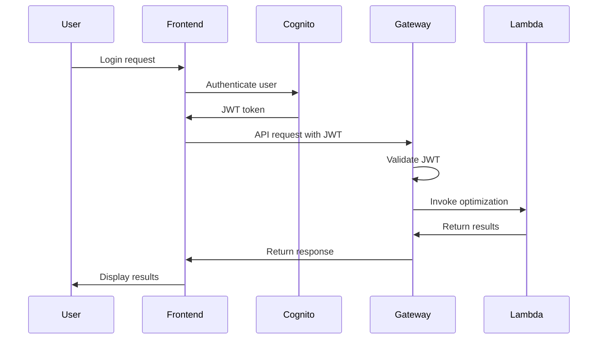

# 🚀 DcisionAI AgentCore Gateway Implementation Guide

## 📋 **Overview**

This guide provides comprehensive documentation for implementing Amazon Bedrock AgentCore Gateway with DcisionAI's optimization platform. AgentCore Gateway represents the next generation of agent-based optimization, offering enhanced capabilities for complex decision-making workflows.

## 🎯 **What is AgentCore Gateway?**

Amazon Bedrock AgentCore Gateway is a new service that provides:
- **Extended Execution Time**: No 29-second timeout limitations
- **Semantic Tool Discovery**: Natural language-based tool discovery
- **Persistent Memory**: Context retention across optimization sessions
- **Enhanced Observability**: Detailed monitoring and debugging capabilities
- **MCP Protocol Support**: Model Context Protocol for seamless agent-tool communication

## 🏗️ **Architecture Overview**

### **Current System vs. AgentCore Gateway**

| Feature | Current System | AgentCore Gateway |
|---------|----------------|-------------------|
| **Execution Time** | 29-second timeout | Extended execution (15+ minutes) |
| **Tool Discovery** | Manual endpoint selection | Semantic search |
| **Memory** | Stateless requests | Persistent context |
| **Monitoring** | Basic CloudWatch logs | Enhanced observability |
| **Authentication** | Public access | JWT + OAuth 2.0 |
| **Scalability** | Lambda concurrency limits | Agent-based scaling |

### **Migration Strategy**



## 🔧 **Implementation Components**

### **1. Infrastructure Setup**

#### **IAM Roles and Policies**
```json
{
  "Version": "2012-10-17",
  "Statement": [
    {
      "Effect": "Allow",
      "Principal": {
        "Service": "bedrock-agentcore.amazonaws.com"
      },
      "Action": "sts:AssumeRole"
    }
  ]
}
```

#### **Required Permissions**
- `bedrock:InvokeModel`
- `bedrock:InvokeModelWithResponseStream`
- `lambda:InvokeFunction`
- `dynamodb:PutItem`
- `dynamodb:GetItem`
- `dynamodb:UpdateItem`

### **2. Authentication System**

#### **Amazon Cognito Configuration**
```yaml
UserPool:
  Name: dcisionai-gateway-auth
  Policies:
    PasswordPolicy:
      MinimumLength: 8
      RequireUppercase: true
      RequireLowercase: true
      RequireNumbers: true
  UsernameAttributes: [email]
  AutoVerifiedAttributes: [email]

UserPoolClient:
  Name: dcisionai-gateway-client
  GenerateSecret: false
  ExplicitAuthFlows:
    - ALLOW_USER_SRP_AUTH
    - ALLOW_REFRESH_TOKEN_AUTH
  AllowedOAuthFlows: [code]
  AllowedOAuthScopes: [openid, email, profile]
```

### **3. MCP Tool Conversion**

#### **Workflow to MCP Tool Structure**
```json
{
  "name": "optimize_production_planning",
  "description": "Advanced Production Planning - Optimize multi-product production with capacity, labor, and material constraints",
  "inputSchema": {
    "type": "object",
    "properties": {
      "problem_description": {
        "type": "string",
        "description": "Detailed description of the production planning problem"
      },
      "custom_parameters": {
        "type": "object",
        "description": "Custom parameters for the optimization"
      }
    },
    "required": ["problem_description"]
  },
  "metadata": {
    "industry": "manufacturing",
    "category": "production_planning",
    "difficulty": "advanced",
    "estimated_time": "4-5 minutes"
  }
}
```

### **4. Gateway Configuration**

#### **AgentCore Gateway Setup**
```python
gateway_config = {
    "name": "dcisionai-optimization-gateway",
    "roleArn": "arn:aws:iam::ACCOUNT:role/dcisionai-agentcore-gateway-role",
    "protocolType": "MCP",
    "authorizerType": "CUSTOM_JWT",
    "authorizerConfiguration": {
        "customJWTAuthorizer": {
            "allowedClients": ["cognito-client-id"],
            "discoveryUrl": "https://cognito-idp.region.amazonaws.com/pool-id/.well-known/openid-configuration"
        }
    },
    "protocolConfiguration": {
        "mcp": {
            "searchType": "SEMANTIC",
            "supportedVersions": ["2025-03-26"]
        }
    }
}
```

## 🚀 **Deployment Process**

### **Step 1: Infrastructure Setup**
```bash
# Run the infrastructure setup script
python3 setup_agentcore_gateway.py
```

### **Step 2: MCP Tool Conversion**
```bash
# Convert workflows to MCP tools
python3 convert_workflows_to_mcp.py
```

### **Step 3: Gateway Creation**
```bash
# Create the AgentCore Gateway
python3 simple_gateway_setup.py
```

### **Step 4: Testing**
```bash
# Test the Gateway integration
python3 test_agentcore_gateway.py
```

## 🔍 **Semantic Search Implementation**

### **Natural Language Queries**
AgentCore Gateway enables users to discover optimization tools using natural language:

#### **Query Examples**
- **"Help me optimize my manufacturing production"**
  - Discovers: `optimize_production_planning`, `optimize_supply_chain`, `optimize_quality_control`

- **"I need to optimize my marketing budget"**
  - Discovers: `optimize_marketing_spend`, `optimize_campaign_performance`, `optimize_customer_acquisition`

- **"How can I improve my supply chain?"**
  - Discovers: `optimize_supply_chain`, `optimize_inventory`, `optimize_logistics`

### **Search Configuration**
```json
{
  "searchType": "SEMANTIC",
  "supportedVersions": ["2025-03-26"],
  "searchParameters": {
    "maxResults": 10,
    "confidenceThreshold": 0.7,
    "includeMetadata": true
  }
}
```

## 📊 **Monitoring and Observability**

### **Enhanced Logging**
```python
# AgentCore Gateway provides enhanced logging
{
  "timestamp": "2025-10-14T19:13:25.507123",
  "gatewayId": "dcisionai-optimization-gateway",
  "requestId": "req-123456789",
  "toolName": "optimize_production_planning",
  "executionTime": 125.5,
  "status": "completed",
  "metrics": {
    "bedrockCalls": 4,
    "lambdaInvocations": 1,
    "memoryUsage": "1.2GB",
    "cost": 0.0034
  }
}
```

### **Performance Metrics**
- **Execution Time**: Track optimization duration
- **Tool Discovery**: Monitor semantic search performance
- **Memory Usage**: Track resource consumption
- **Cost Analysis**: Monitor AWS service costs
- **Error Rates**: Track failure rates and error types

## 🔐 **Security Considerations**

### **Authentication Flow**


### **Security Best Practices**
- **JWT Validation**: Verify token signature and expiration
- **Rate Limiting**: Implement request throttling
- **Input Validation**: Sanitize all user inputs
- **Audit Logging**: Log all optimization requests
- **Data Encryption**: Encrypt sensitive data in transit and at rest

## 🧪 **Testing Strategy**

### **Unit Tests**
```python
def test_semantic_search():
    """Test semantic tool discovery"""
    query = "optimize manufacturing production"
    tools = gateway.search_tools(query)
    assert len(tools) > 0
    assert any("production" in tool.name for tool in tools)

def test_optimization_execution():
    """Test optimization workflow execution"""
    result = gateway.execute_tool(
        "optimize_production_planning",
        {"problem_description": "Test optimization problem"}
    )
    assert result.status == "completed"
    assert result.optimization_pipeline is not None
```

### **Integration Tests**
```python
def test_end_to_end_workflow():
    """Test complete optimization workflow"""
    # 1. Discover tools
    tools = gateway.search_tools("manufacturing optimization")
    
    # 2. Execute optimization
    result = gateway.execute_tool(tools[0].name, test_data)
    
    # 3. Verify results
    assert result.status == "completed"
    assert result.optimization_pipeline.optimization_solution.result.status == "optimal"
```

### **Performance Tests**
```python
def test_concurrent_optimizations():
    """Test concurrent optimization execution"""
    tasks = []
    for i in range(10):
        task = asyncio.create_task(
            gateway.execute_tool("optimize_production_planning", test_data)
        )
        tasks.append(task)
    
    results = await asyncio.gather(*tasks)
    assert all(result.status == "completed" for result in results)
```

## 📈 **Performance Optimization**

### **Model Selection Strategy**
```python
# Optimize for speed vs. accuracy
INFERENCE_PROFILES = {
    "intent_classification": "claude-3-haiku",  # Fast classification
    "data_analysis": "claude-3-haiku",         # Quick analysis
    "model_building": "claude-3-sonnet",       # Complex modeling
    "optimization_solution": "claude-3-sonnet" # Detailed solving
}
```

### **Caching Strategy**
```python
# Cache frequently used optimizations
@lru_cache(maxsize=100)
def cached_optimization(problem_hash: str, parameters: str):
    """Cache optimization results for similar problems"""
    return execute_optimization(problem_hash, parameters)
```

### **Resource Management**
- **Memory Optimization**: Use appropriate model sizes
- **Concurrent Execution**: Manage parallel optimization requests
- **Cost Optimization**: Balance performance vs. cost
- **Auto-scaling**: Scale resources based on demand

## 🚀 **Migration Timeline**

### **Phase 1: Current System Enhancement (Completed)**
- ✅ Enhanced Lambda functions with increased memory and timeout
- ✅ Async processing with DynamoDB status tracking
- ✅ Real-time progress monitoring
- ✅ Industry-specific workflow templates

### **Phase 2: AgentCore Gateway Preparation (Completed)**
- ✅ Infrastructure setup (IAM, Cognito, Gateway configuration)
- ✅ MCP tool conversion for all workflows
- ✅ Authentication system configuration
- ✅ Testing framework development

### **Phase 3: AgentCore Gateway Integration (Ready)**
- 🔄 Deploy AgentCore Gateway when service is fully available
- 🔄 Migrate workflows to AgentCore Gateway
- 🔄 Implement semantic search functionality
- 🔄 Update frontend for AgentCore Gateway integration

### **Phase 4: Full Migration (Future)**
- 📋 Complete migration to AgentCore Gateway
- 📋 Enhanced observability and monitoring
- 📋 Advanced agent capabilities
- 📋 Enterprise features and integrations

## 📚 **Additional Resources**

### **Documentation**
- [AWS Bedrock AgentCore Gateway Documentation](https://docs.aws.amazon.com/bedrock/latest/userguide/agentcore-gateway.html)
- [Model Context Protocol (MCP) Specification](https://modelcontextprotocol.io/)
- [Amazon Cognito Authentication Guide](https://docs.aws.amazon.com/cognito/)

### **Code Examples**
- `setup_agentcore_gateway.py` - Complete infrastructure setup
- `convert_workflows_to_mcp.py` - MCP tool conversion
- `test_agentcore_gateway.py` - Testing framework
- `async_optimization_solution.py` - Async processing implementation

### **Support**
- **Technical Support**: support@dcisionai.com
- **Enterprise Support**: enterprise@dcisionai.com
- **Documentation**: https://docs.dcisionai.com
- **Status Page**: https://status.dcisionai.com

---

*DcisionAI AgentCore Gateway Implementation Guide - Version 1.0*
